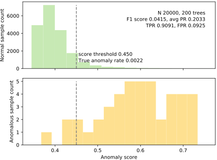
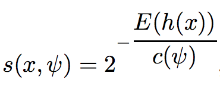

# Isolation Forest Implementation

The goal of this project is to implement the original [Isolation Forest](IsolationForestPaper.pdf) algorithm by Fei Tony Liu, Kai Ming Ting, and Zhi-Hua Zhou.  (A later version of this work is also available: [Isolation-based Anomaly Detection](http://citeseerx.ist.psu.edu/viewdoc/download?doi=10.1.1.673.5779&rep=rep1&type=pdf).) There are two general approaches to anomaly detection: 

1. Model what normal looks like and then look for nonnormal observations
2. focus on the anomalies, which are few and different. This is the interesting and relatively-new approach taken by the authors of isolation forests.

The isolation forest algorithm is original and beautiful in its simplicity; and also seems to work very well, with a few known weaknesses. Also, the academic paper is extremely readable.

## Data sets

Three data sets were used to test the implementation:

* [Kaggle credit card fraud competition data set](https://www.kaggle.com/mlg-ulb/creditcardfraud); download, unzip to get `creditcard.csv`

* Get cancer data into `cancer.csv` by executing [savecancer.csv](https://github.com/parrt/msds689/blob/master/projects/iforest/savecancer.py) that I provide.

* [http.zip](https://github.com/parrt/msds689/blob/master/projects/iforest/http.zip); download, unzip to get `http.csv`.

## Visualization of normal versus anomaly separation

Using [plot_anomalies.py](https://github.com/parrt/msds689/blob/master/projects/iforest/plot_anomalies.py), we can see the results of the isolation forest trying to detect anomalies. These data sets all have known targets indicating normal versus anomaly, but this information is only used during testing and not during training. In other words, we use this information to discover how well we can separate the distribution of normal versus anomalous observations.  The section provides a number of results, but yours might look different because of the inherent randomness involved in selecting subsets of the data and constructing random trees.

<table border="0">
<tr><td>http.csv, 200 trees, 99% desired TPR</td></tr>
<tr>
<td border=0>

</tr>
</table>

<table border="0">
<tr><td>creditcard.csv, 200 trees, 80% desired TPR</td><td>creditcard.csv, 200 trees, 90% desired TPR</td></tr>
<tr>
<td border=0>

<td border=0>

</tr>
</table>

<table border="0">
<tr><td> cancer, 300 trees, 70% desired TPR</td><td> cancer, 300 trees, 80% desired TPR</td></tr>
<tr>
<td border=0>

<td border=0>

</tr>
</table>

## Algorithm

Here's a rough overview of the algorithms from the Liu *et al* paper, which were used in this project (Some algorithms are slightly different from the version suggested in the paper):

<table border="0">
<tr>
<td width="50%" valign="top"></td><td width="50%" valign="top"></td>
</tr>
<tr>
<td valign="top">

</td>
<td valign="top">
This is the version of average path length <tt>c()</tt>, used (different from the original paper): 

Also, here's the scoring formula: 

where "<i>H(i)</i> is the harmonic number and it can be estimated by <i>ln(i)</i> + 0.5772156649 (Euler’s constant)."
</td>
</tr>
</table>

## Improving on the original algorithm

One of the known weaknesses of the original isolation forest is that it can't handle lots of irrelevant or noisy features (columns).  I added noise to see how well the original algorithm performs. With 5 noise columns, the algorithm started struggling, in speed. I made only one tweak and that increased the speed by a factor of 10. Instead of choosing a split point randomly, as suggested in point 6 of algorithm 2, I used the beta distribution to choose a split point. This ensures that more of the splits made are around the extremums of the attribute, than in the center.
